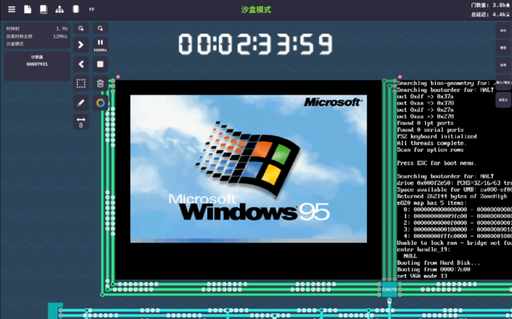
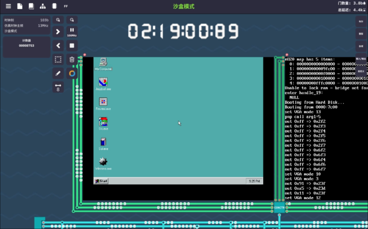
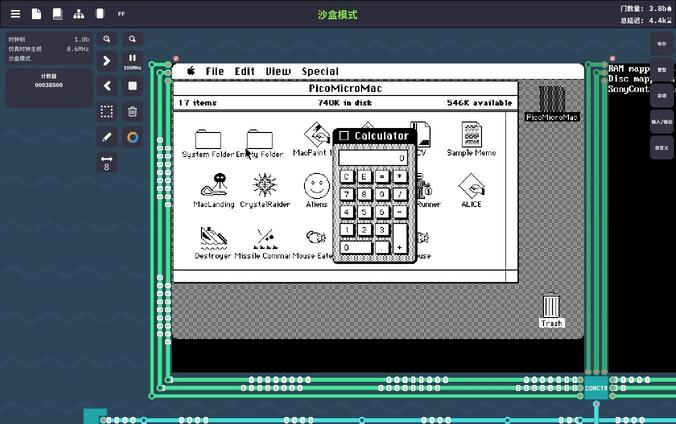
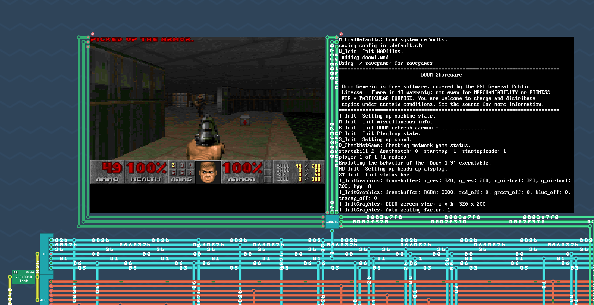
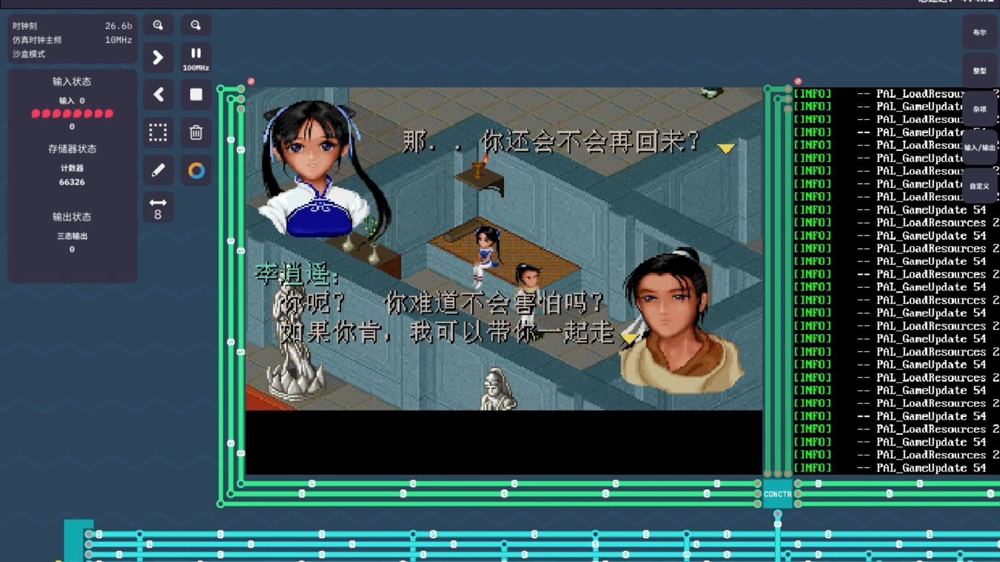
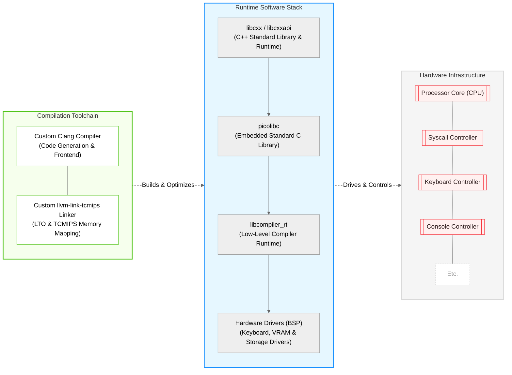

<p align="center">
  
</p>

## TCMIPS

This repository hosts the full TCMIPS ecosystem, including TCMIPS CPU architecture game save files, the `tcmips_core`
library, and ported `picolibc` and `libc++` standard libraries, along with a complete C/C++ development toolchain built
for the `Turing Complete` sandbox simulator.

It integrates a modified Clang compiler and a custom linker to compile standard C/C++ source code into fully linked
`.tcm` binaries. These compiled .tcm binaries can be loaded and executed directly via the in-game File Loader on the
imported TCMIPS CPU architecture, which natively supports peripherals such as input devices, pixel/ascii consoles, 
and seven-segment displays.

## Features

* **Modified Clang Compiler**: An LLVM/Clang compiler tailored for the TCMIPS architecture, supporting its custom
  instruction encodings, register allocation scheme and pipeline design.
* **Custom Linker (`llvm-link-tcmips`)**: A dedicated linker that resolves object files and outputs `.tcm` executables
  formatted for the in-game File Loader environment.
* **Integrated Core Library (`tcmips_core`)**: A foundational runtime library integrating ported picolibc, libc++ and
  compiler-rt, providing standard C/C++ runtime features and memory allocation for the virtual hardware.
* **Software Arithmetic Support**: Full software floating-point emulation and 64‑bit integer operation support via
  compiler-rt, enabling complex computations on custom virtual hardware.
* **Dedicated I/O Syscall Interface**: Built-in architecture support for in-game peripherals through dedicated MIPS
  syscalls, including sound, keyboard, display console and seven-segment display array.

## Repository Structure

- `/tcmips` — Core library integrating runtime libraries and peripheral drivers.
- `/toolchains` — Prebuilt cross-toolchain, CMake toolchain file and sysroot.
- `/tools` — Python scripts.
- `/test` — Test cases.
- `/docs` — Architecture documents: ISA, memory layout, boot flow.
- `/demo` — Sample demos.
- `/gamesave` — Game save files for TCMIPS architecture.

## Demo

- Booting Win95 via tiny386

  
  

---

- Booting Macintosh via umac

  

---

- Doom

  

---

- SDLPAL

  


More Demos:
https://space.bilibili.com/28801454/lists/8407732

## Technology Stack




## Build Toolchain and Sysroot

**Note: You can skip this section if you use the prebuilt toolchain from the project Release page.**

### 1. Build LLVM

Build the customized LLVM toolchain by referring to this repository:

[https://github.com/zhangjiantao/tcmips-llvm](https://github.com/zhangjiantao/tcmips-llvm)

### 2. Deploy LLVM Build Artifacts

```shell
# Create target toolchain directory
mkdir -p ./toolchains/llvm/bin

# Copy core compiler and linker
cp ${LLVM_BUILD_PATH}/bin/clang ./toolchains/llvm/bin/
cp ${LLVM_BUILD_PATH}/bin/clang++ ./toolchains/llvm/bin/
cp ${LLVM_BUILD_PATH}/bin/llvm-link-tcmips ./toolchains/llvm/bin/

# Grant executable permission
chmod +x ./toolchains/llvm/bin/*
```

### 3. Build Sysroot

Construct a minimal sysroot environment, which provides target platform header files, static libraries for cross-compilation.

```shell
cmake -G Ninja -S . -B build -DCMAKE_BUILD_TYPE=Release

cmake --build build --target tcmips_cores_all
```

## Build Your C/C++ Project

```shell
cd ${YOUR_PROJECT_ROOT}

cmake -G Ninja -S . -B build \
  -DCMAKE_BUILD_TYPE=Release \
  -DCMAKE_TOOLCHAIN_FILE=${TCMIPS_PROJECT_ROOT}/toolchains/cmake/tcmips.toolchain.cmake

cmake --build build

```

**Note:** Replace `${TCMIPS_PROJECT_ROOT}` with `this project` root path.

The compiled .tcm file can be loaded and executed directly.

## Related Repositories

* [https://github.com/zhangjiantao/tcmips-llvm](https://github.com/zhangjiantao/tcmips-llvm)

