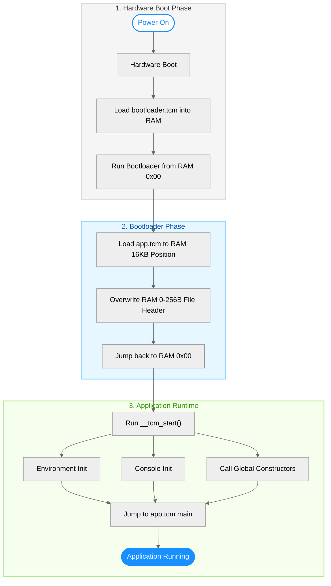

```mermaid
%%{init: {'theme': 'neutral'}}%%
flowchart TD

%% Stage 1: Hardware Boot
    subgraph Stage1 [1. Hardware Boot Phase]
        A([Power On]) --> B[Hardware Boot]
        B --> C[Load bootloader.tcm into RAM]
        C --> D[Run Bootloader from RAM 0x00]
    end

%% Stage 2: Bootloader Stage
    subgraph Stage2 [2. Bootloader Phase]
        E[Load app.tcm to RAM 16KB Position] --> F[Overwrite RAM 0-256B File Header]
        F --> G[Jump back to RAM 0x00]
    end

%% Stage 3: App Runtime
    subgraph Stage3 [3. Application Runtime]
        H["Run __tcm_start()"] --> I1[Environment Init]
        H --> I2[Console Init]
        H --> I3[Call Global Constructors]

        I1 --> J[Jump to app.tcm main]
        I2 --> J[Jump to app.tcm main]
        I3 --> J[Jump to app.tcm main]
        J --> K([Application Running])
    end

    D --> E
    G --> H

%% Styles
    style Stage1 fill:#f5f5f5,stroke:#d9d9d9,stroke-width:2px,color:#333
    style Stage2 fill:#e6f7ff,stroke:#91d5ff,stroke-width:2px,color:#0050b3
    style Stage3 fill:#f6ffed,stroke:#b7eb8f,stroke-width:2px,color:#389e0d
    style A fill:#ffffff,stroke:#1890ff,stroke-width:2px,color:#1890ff
    style K fill:#1890ff,stroke:#1890ff,stroke-width:2px,color:#ffffff
```
