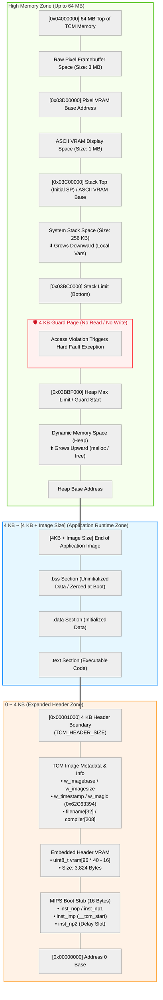

```mermaid
%%{init: {'theme': 'neutral'}}%%
flowchart BT

    subgraph Section1 ["0 ~ 4 KB (Expanded Header Zone) &nbsp;&nbsp;&nbsp;&nbsp;&nbsp;&nbsp;&nbsp;&nbsp;&nbsp;&nbsp;&nbsp;&nbsp;&nbsp;&nbsp;&nbsp;&nbsp;&nbsp;&nbsp;&nbsp;&nbsp;&nbsp;&nbsp;&nbsp;&nbsp;&nbsp;&nbsp;&nbsp;&nbsp;&nbsp;&nbsp;&nbsp;&nbsp;&nbsp;&nbsp;&nbsp;&nbsp;&nbsp;&nbsp;&nbsp;&nbsp;&nbsp;&nbsp;&nbsp;&nbsp;&nbsp;&nbsp;&nbsp;&nbsp;&nbsp;&nbsp;"]
        Addr0["[0x00000000] Address 0 Base"] --- MIPS_Stub["MIPS Boot Stub (16 Bytes)<br>• inst_nop / inst_np1<br>• inst_jmp (__tcm_start)<br>• inst_np2 (Delay Slot)"]
        MIPS_Stub --- Header_VRAM["Embedded Header VRAM<br>• uint8_t vram[96 * 40 - 16]<br>• Size: 3,824 Bytes"]
        Header_VRAM --- Meta_Fields["TCM Image Metadata & Info<br>• w_imagebase / w_imagesize<br>• w_timestamp / w_magic (0x62C63394)<br>• filename[32] / compiler[208]"]
        Meta_Fields --- Addr4K["[0x00001000] 4 KB Header Boundary<br>(TCM_HEADER_SIZE)"]
    end

    subgraph Section3 ["4 KB ~ [4 KB + Image Size] (Application Runtime Zone) &nbsp;&nbsp;&nbsp;&nbsp;&nbsp;&nbsp;&nbsp;&nbsp;&nbsp;&nbsp;&nbsp;&nbsp;&nbsp;&nbsp;&nbsp;&nbsp;&nbsp;&nbsp;&nbsp;"]
        TEXT[".text Section (Executable Code)"]
        TEXT --- DATA[".data Section (Initialized Data)"]
        DATA --- BSS[".bss Section (Uninitialized Data / Zeroed at Boot)"]
        BSS --- AddrAppEnd["[4KB + Image Size] End of Application Image"]
    end

    subgraph Section4 ["High Memory Zone (Up to 64 MB) &nbsp;&nbsp;&nbsp;&nbsp;&nbsp;&nbsp;&nbsp;&nbsp;&nbsp;&nbsp;&nbsp;&nbsp;&nbsp;&nbsp;&nbsp;&nbsp;&nbsp;&nbsp;&nbsp;&nbsp;&nbsp;&nbsp;&nbsp;&nbsp;&nbsp;&nbsp;&nbsp;&nbsp;&nbsp;&nbsp;&nbsp;&nbsp;&nbsp;&nbsp;&nbsp;&nbsp;&nbsp;&nbsp;&nbsp;&nbsp;&nbsp;&nbsp;&nbsp;&nbsp;&nbsp;&nbsp;&nbsp;"]
        AddrHeapStart["Heap Base Address"] --- HeapZone["Dynamic Memory Space (Heap)<br>⬆️ Grows Upward (malloc / free)"]
        HeapZone --- AddrGuardStart["[0x03BBF000] Heap Max Limit / Guard Start"]

        subgraph GuardZone ["🛡️ 4 KB Guard Page (No Read / No Write)"]
            GuardBody["Access Violation Triggers Hard Fault Exception"]
        end

        AddrGuardStart --- GuardZone --- AddrStackLimit["[0x03BC0000] Stack Limit (Bottom)"]
        AddrStackLimit --- StackZone["System Stack Space (Size: 256 KB)<br>⬇️ Grows Downward (Local Vars)"]
        StackZone --- AddrStackTop["[0x03C00000] Stack Top (Initial SP) / ASCII VRAM Base"]

        AddrStackTop --- VRAM_ASCII["ASCII VRAM Display Space (Size: 1 MB)"]
        VRAM_ASCII --- AddrVRAMPixel["[0x03D00000] Pixel VRAM Base Address"]
        AddrVRAMPixel --- VRAM_Pixel["Raw Pixel Framebuffer Space (Size: 3 MB)"]
        VRAM_Pixel --- Addr64M["[0x04000000] 64 MB Top of TCM Memory"]
    end

    Addr4K === TEXT
    AddrAppEnd === AddrHeapStart

    style Section1 fill:#fff2e6,stroke:#ffa940,stroke-width:2px,color:#333
    style Section3 fill:#e6f7ff,stroke:#1890ff,stroke-width:2px,color:#333
    style Section4 fill:#f6ffed,stroke:#52c41a,stroke-width:2px,color:#333
    style GuardZone fill:#fff1f0,stroke:#ff4d4f,stroke-width:2px,color:#cf1322

```
