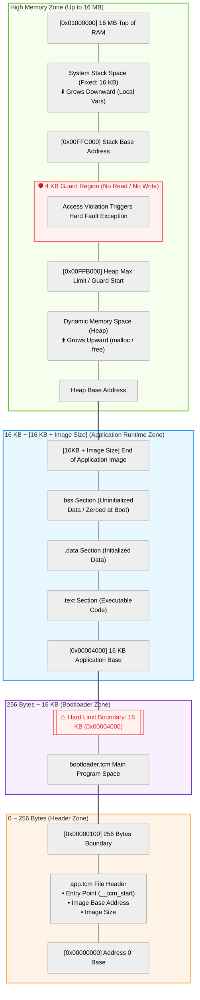

```mermaid
%%{init: {'theme': 'neutral'}}%%
flowchart BT

    subgraph Section1 ["0 ~ 256 Bytes (Header Zone) &nbsp;&nbsp;&nbsp;&nbsp;&nbsp;&nbsp;&nbsp;&nbsp;&nbsp;&nbsp;&nbsp;&nbsp;&nbsp;&nbsp;&nbsp;&nbsp;&nbsp;&nbsp;&nbsp;&nbsp;&nbsp;&nbsp;&nbsp;&nbsp;&nbsp;&nbsp;&nbsp;&nbsp;&nbsp;&nbsp;&nbsp;&nbsp;&nbsp;&nbsp;&nbsp;&nbsp;&nbsp;&nbsp;&nbsp;&nbsp;&nbsp;&nbsp;&nbsp;&nbsp;&nbsp;&nbsp;&nbsp;&nbsp;&nbsp;&nbsp;&nbsp;&nbsp;&nbsp;&nbsp;&nbsp;&nbsp;&nbsp;"]
        Addr0["[0x00000000] Address 0 Base"] --- Fields["app.tcm File Header<br>• Entry Point (__tcm_start)<br>• Image Base Address<br>• Image Size"]
        Fields --- Addr256["[0x00000100] 256 Bytes Boundary"]
    end

    subgraph Section2 ["256 Bytes ~ 16 KB (Bootloader Zone) &nbsp;&nbsp;&nbsp;&nbsp;&nbsp;&nbsp;&nbsp;&nbsp;&nbsp;&nbsp;&nbsp;&nbsp;&nbsp;&nbsp;&nbsp;&nbsp;&nbsp;&nbsp;&nbsp;&nbsp;&nbsp;&nbsp;&nbsp;&nbsp;&nbsp;&nbsp;&nbsp;&nbsp;&nbsp;&nbsp;&nbsp;&nbsp;&nbsp;&nbsp;&nbsp;&nbsp;&nbsp;&nbsp;&nbsp;&nbsp;&nbsp;&nbsp;&nbsp;&nbsp;&nbsp;"]
        BL_Space["bootloader.tcm Main Program Space"] --- LimitLine[["⚠️ Hard Limit Boundary: 16 KB (0x00004000)"]]
    end

    subgraph Section3 ["16 KB ~ [16 KB + Image Size] (Application Runtime Zone) &nbsp;&nbsp;&nbsp;&nbsp;&nbsp;&nbsp;&nbsp;&nbsp;&nbsp;&nbsp;&nbsp;&nbsp;&nbsp;&nbsp;&nbsp;"]
        Addr16K["[0x00004000] 16 KB Application Base"] --- TEXT[".text Section (Executable Code)"]
        TEXT --- DATA[".data Section (Initialized Data)"]
        DATA --- BSS[".bss Section (Uninitialized Data / Zeroed at Boot)"]
        BSS --- AddrAppEnd["[16KB + Image Size] End of Application Image"]
    end

    subgraph Section4 ["High Memory Zone (Up to 16 MB) &nbsp;&nbsp;&nbsp;&nbsp;&nbsp;&nbsp;&nbsp;&nbsp;&nbsp;&nbsp;&nbsp;&nbsp;&nbsp;&nbsp;&nbsp;&nbsp;&nbsp;&nbsp;&nbsp;&nbsp;&nbsp;&nbsp;&nbsp;&nbsp;&nbsp;&nbsp;&nbsp;&nbsp;&nbsp;&nbsp;&nbsp;&nbsp;&nbsp;&nbsp;&nbsp;&nbsp;&nbsp;&nbsp;&nbsp;&nbsp;&nbsp;&nbsp;&nbsp;&nbsp;&nbsp;&nbsp;&nbsp;"]
        AddrHeapStart["Heap Base Address"] --- HeapZone["Dynamic Memory Space (Heap)<br>⬆️ Grows Upward (malloc / free)"]
        HeapZone --- AddrGuardStart["[0x00FFB000] Heap Max Limit / Guard Start"]

        subgraph GuardZone ["🛡️ 4 KB Guard Region (No Read / No Write)"]
            GuardBody["Access Violation Triggers Hard Fault Exception"]
        end

        AddrGuardStart --- GuardZone --- AddrStackStart["[0x00FFC000] Stack Base Address"]
        AddrStackStart --- StackZone["System Stack Space (Fixed: 16 KB)<br>⬇️ Grows Downward (Local Vars)"]
        StackZone --- Addr16M["[0x01000000] 16 MB Top of RAM"]
    end

    Addr256 === BL_Space
    LimitLine === Addr16K
    AddrAppEnd === AddrHeapStart

    style Section1 fill:#fff2e6,stroke:#ffa940,stroke-width:2px,color:#333
    style Section2 fill:#f9f0ff,stroke:#722ed1,stroke-width:2px,color:#333
    style Section3 fill:#e6f7ff,stroke:#1890ff,stroke-width:2px,color:#333
    style Section4 fill:#f6ffed,stroke:#52c41a,stroke-width:2px,color:#333
    style GuardZone fill:#fff1f0,stroke:#ff4d4f,stroke-width:2px,color:#cf1322
    style LimitLine fill:#fff1f0,stroke:#f5222d,color:#f5222d
```
