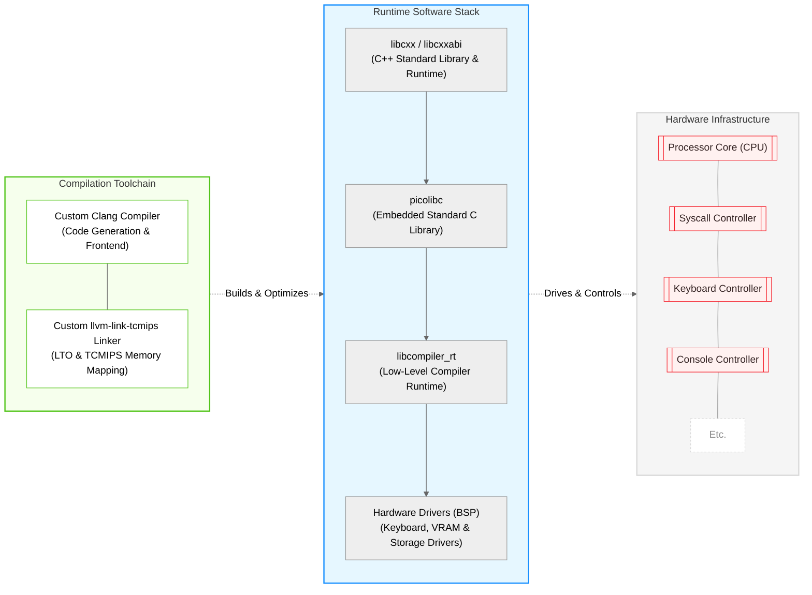

```mermaid
%%{init: {'theme': 'neutral'}}%%
flowchart LR
    subgraph HardwareBox ["Hardware Infrastructure"]
        CpuCore[["Processor Core (CPU)"]]
        Syscall[["Syscall Controller"]]
        KbdCtrl[["Keyboard Controller"]]
        ConCtrl[["Console Controller"]]
        HwOthers["Etc."]

        CpuCore --- Syscall --- KbdCtrl --- ConCtrl --- HwOthers
    end

    subgraph ToolchainBox ["Compilation Toolchain"]
        Clang["Custom Clang Compiler<br>(Code Generation & Frontend)"]
        Linker["Custom llvm-link-tcmips Linker<br>(LTO & TCMIPS Memory Mapping)"]

        Clang --- Linker
    end

    subgraph SoftwareBox ["Runtime Software Stack"]
        libcxx["libcxx / libcxxabi<br>(C++ Standard Library & Runtime)"]
        picolibc["picolibc<br>(Embedded Standard C Library)"]
        compiler_rt["libcompiler_rt<br>(Low-Level Compiler Runtime)"]
        bsp_drivers["Hardware Drivers (BSP)<br>(Keyboard, VRAM & Storage Drivers)"]

        libcxx ---> picolibc ---> compiler_rt ---> bsp_drivers
    end

    ToolchainBox -.->|Builds & Optimizes| SoftwareBox
    SoftwareBox -.->|Drives & Controls| HardwareBox

    style HardwareBox fill:#f5f5f5,stroke:#d9d9d9,stroke-width:2px,color:#333
    style ToolchainBox fill:#f6ffed,stroke:#52c41a,stroke-width:2px,color:#333
    style SoftwareBox fill:#e6f7ff,stroke:#1890ff,stroke-width:2px,color:#333

    style Clang fill:#ffffff,stroke:#52c41a,stroke-width:1px
    style Linker fill:#ffffff,stroke:#52c41a,stroke-width:1px

    style CpuCore fill:#fff1f0,stroke:#f5222d,color:#322
    style Syscall fill:#fff1f0,stroke:#f5222d,color:#322
    style KbdCtrl fill:#fff1f0,stroke:#f5222d,color:#322
    style ConCtrl fill:#fff1f0,stroke:#f5222d,color:#322
    style HwOthers fill:#ffffff,stroke:#d9d9d9,stroke-dasharray: 3 3,color:#8c8c8c
```
